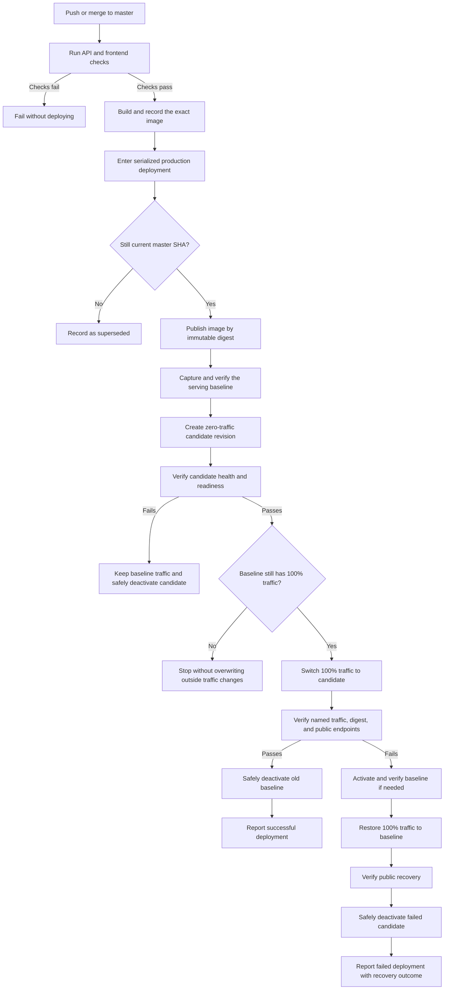

# Steady

[](https://www.delasc.io/)

Steady is a personal mood, activity, and weekly-goal tracker. The production
application is available at [www.delasc.io](https://www.delasc.io/).

## Current architecture

| Responsibility | Current service |
| --- | --- |
| Browser application | React 16, Tailwind CSS, Auth0 React SDK |
| API and static hosting | Standalone TypeScript API on Deno 2.9.4 |
| Application data | Supabase Postgres in Sydney, in the private `steady` schema |
| Authentication | Auth0 (`dev-vin.au.auth0.com`) |
| Compute hosting | Azure Container Apps in Australia East |
| Encrypted backups | A separate private Supabase Storage project in Sydney |

The Deno container serves both the built React application and its HTTP API.
It validates Auth0 access tokens and accesses Postgres with a restricted runtime
role. Forced row-level security and explicit application predicates both enforce
row ownership.

```text
Browser / React ── Auth0 access token ──▶ Deno TypeScript API ──▶ Supabase Postgres
                                              │
                                              └── serves the built React files
```

The retired Go API, Heroku application, and MongoDB runtime are no longer part
of the live system. Their final encrypted migration and decommission backups
are retained according to the project runbooks.

## Production deployment

Updates to `master` deploy through GitHub Actions using blue-green behaviour at
the Azure Container Apps revision level. The current revision continues serving
production while a temporary candidate revision is created and verified. This
uses the existing Container App rather than a second environment or permanent
standby capacity.



Every traffic or revision mutation is checked against Azure state. Cleanup
refuses to deactivate the named serving revision, and a recovered deployment
remains reported as failed so the original release problem stays visible. See
the [Azure Container Apps runbook](docs/runbooks/azure-container-apps.md) for
configuration, investigation, and manual recovery procedures.

## Project structure

```text
api/                       Deno TypeScript API and production OCI image
client/                    React browser application
supabase/                  Postgres migrations and local Supabase configuration
tools/backup/              Encrypted backup and restore tooling
tools/migrate/             MongoDB-to-Postgres migration tooling
tools/rollback/            Migration reconciliation and rollback tooling
docs/runbooks/             Deployment, backup, restore, and operations guides
specs/backend-migration/   AI Engineering OS migration contracts and evidence
```

## HTTP interface

The user-facing routes require a valid Auth0 access token:

| Method | Path | Behaviour |
| --- | --- | --- |
| `GET` | `/api/feelings` | List the authenticated user's feelings |
| `POST` | `/api/feelings` | Create one feeling |
| `GET` | `/api/weekly-tracker?weekOf=YYYY-MM-DD` | Read the user's tracker for a week |
| `POST` | `/api/weekly-tracker` | Create or update the user's tracker for a week |

`GET /healthz` checks process liveness and `GET /readyz` checks database
readiness. Retired chat, agent, and ping routes are intentionally absent.

## Running locally

Prerequisites are Node.js 20+, npm, Deno 2.9.4, and access to a suitable local
or hosted Postgres database with the migrations under `supabase/migrations/`
applied.

Run the API from `api/`:

```bash
deno task start
```

For the disposable local Supabase CLI database, apply the migrations under
`supabase/`, point `DATABASE_URL` at loopback port `55322`, and set
`DATABASE_SSL_MODE=disable`. `deno task start` allowlists that loopback
Postgres endpoint; hosted TLS remains `DATABASE_SSL_MODE=require`.

Run the browser application from a second terminal:

```bash
cd client
npm ci
npm start
```

The development browser runs at
[http://localhost:3000](http://localhost:3000) and sends API requests to
`http://localhost:8080`. See [api/README.md](api/README.md) for the complete
security, database, and test contract.

To build the same combined image used by Azure, run from the repository root:

```bash
docker build -f api/Dockerfile -t steady-api .
```

## Server configuration

Secrets belong in the deployment provider and must not be committed. The API
recognizes these environment variable names:

| Variable | Purpose |
| --- | --- |
| `DATABASE_URL` | Restricted `steady_runtime` Supavisor transaction-pooler URL |
| `DATABASE_SSL_MODE` | Database TLS mode; hosted environments require `require` |
| `AUTH0_ISSUER` | Exact Auth0 token issuer |
| `AUTH0_AUDIENCE` | Exact Auth0 API audience |
| `CORS_ORIGINS` | Comma-separated exact browser origins |
| `DEPLOYMENT_VERSION` | Release identifier used in operational logs |
| `HOST` | Listener address; defaults to `0.0.0.0` |
| `PORT` | Listener port; defaults to `8080` |
| `STATIC_ROOT` | Built browser assets in the combined container |

The Auth0 audience intentionally remains the historical Heroku URL identifier.
It is an opaque Auth0 API identifier, not a network dependency, and changing it
requires a separately planned authentication migration.

## Verification

API checks, from `api/`:

```bash
deno task fmt:check
deno task lint
deno task check
deno task test
```

Frontend checks, from `client/`:

```bash
CI=true npm test -- --watchAll=false
npm run build
```

## Operations and migration references

- [Azure Container Apps runbook](docs/runbooks/azure-container-apps.md)
- [Backup runbook](docs/runbooks/backup.md)
- [Restore runbook](docs/runbooks/restore.md)
- [Host migration guide](docs/host-migration-guide.md)
- [Monitoring and support runbook](docs/runbooks/monitoring-support.md)
